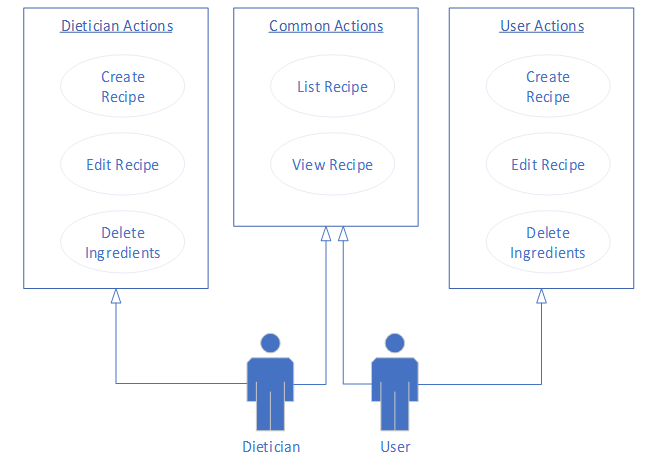
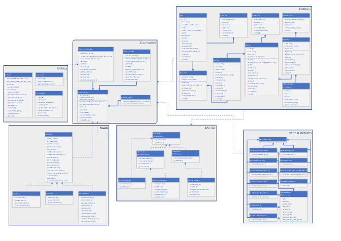

# Recipemanager

## Build and Generate the JAR file (compile the source code)
```bash
# Git clone (download the soruce code)
$ git clone https://github.com/mallikaravi/recipe-manager.git
$ cd recipe-manager

# Build and Generate the JAR file (compile the source code)
$ mvn clean package install 
$ java -jar recipe-manager-0.0.1.jar  

# How to genrate jar file from Eclipse IDE
# Launch Eclipse IDE >
   > Import porject from local drive
   > Select pom.xml > Right Click > Run As > Run configuraions Dialog, Enter "clean package install" in Goals text box

# Run the recipe manager application, assets folder and jar file should be in same path.
.
├── ...
    ├──assets
    ├──recipe-manager-0.0.1.jar
```
# Table of Contents
<!--ts-->
   * [Prerequisites](#prerequisites)
   * [About](#about)
   * [Project SetUp](#project-setup)
   * [Implementation And Design](#implementation-and-design)
      * [Define a simple Maven Build](#define-a-simple-maven-build)
        * [Dependencies](#dependencies)
        * [Class Diagram](#class-diagram)
        * [UseCase Diagram](#usecase-diagram)
   *  [Tool Used For Project Management](#tool-used-for-project-management)

        
<!--te-->


Prerequisites
============
### - JDK 17.0.2
### - Maven


About
============
Recipe Manager is a terminal based application.There will be two persons using this application.

They are:

1. User
2. Dietician

  ### User
  In the application,when we switch to user,the user can perform the following tasks
    List all the weeks
    view aRecipies
    Generate a Recipe Week
    view Recipies
    
   ### Dietician   
   In the application,when we switch to dietician,he can perform the following tasks
     Create a Recipie
     View Recipe
     Update Recipe
    view all Recipies
  

Project setUp
============
First you’ll need to setup a Java project for Maven to build. 

Implementation and Design
============
Explained here 

https://github.com/mallikaravi/recipe-manager/blob/main/design/DesignDocument.pdf

### Usecase Diagram: 



### Class Diagram 



Technology
============
The following technologies are used in designing and developing the recipe manager application.

1. Java – Coding language for implementing the Recipe Manager application
2. Eclipse - IDE Purpose 
3. Microsoft Visio - UML Diagram tool
4. Maven - Bulding tool
5. JAXB - Parsing and Saving the recipemanager models

Define a simple Maven Build
============
1.You need to create a Maven project definition.
2.Maven projects are defined with an XML file named pom.xml.
3.Among other things, this file gives the project’s name, version, and dependencies that it has on external libraries.
4.Create a file named pom.xml at the root of the project.

Maven Dependencies
============

```
	<dependencies>
		<dependency>
			<groupId>org.glassfish.jaxb</groupId>
			<artifactId>jaxb-runtime</artifactId>
			<version>4.0.0</version>
		</dependency>

	</dependencies>
```

This is the simplest possible pom.xml file necessary to build a Java project. It includes the following details of the project configuration:

*  modelVersion- POM model version (always 4.0.0).
*  groupId -  Group or organization that the project belongs to. Often expressed as an inverted domain name.
*  artifactId - Name to be given to the project’s library artifact (for example, the name of its JAR or WAR file).
*  version  -  Version of the project that is being built.

Tool used for project management
============
JIRA tool is used for this project, mainly maintaining the recipe-manager application backlogs. In sort following activities are done
- EPIC
- User stories
- Sprint handling
- etc.

### Link 
https://github.com/mallikaravi/recipe-manager/blob/main/design/DesignDocument.pdf


